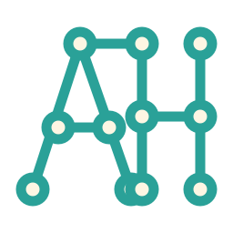

# Achib Hossen

The latest iteration of my personal website, built with Vite and React.

## ⚙️ Installation & Setup

Make sure Node.js and npm are installed on your machine.

1. Clone the source code:
  ```sh
   git clone https://github.com/achibhossengit/portfolio-site.git
   cd Portfolio-WebSite
  ```
2. Install the dependencies:
  ```sh
   npm install
  ```
3. Start the development server:
  ```sh
   npm run dev
  ```
   The website will be available at `http://localhost:8080`.

## 🛠️ Building and Running for Production

1. Generate an optimized production build locally:
  ```sh
   npm run build
  ```
   Vite generates the production files in `dist`. This directory is ignored by Git and is not pushed to GitHub.
2. Preview the production build locally:
  ```sh
   npm run preview
  ```

## 🚀 Deployment

This website is deployed on [Netlify](https://www.netlify.com/) directly from the GitHub repository.

Netlify uses the following build configuration:

- Build command: `npm run build`
- Publish directory: `dist`

When changes are pushed to the configured production branch, Netlify installs the dependencies, builds the project, and deploys the generated `dist` directory automatically. The build output does not need to be committed to GitHub.

## 💻 Technologies

- React
- Vite
- Tailwind CSS
- DaisyUI
- React Icons
- React GitHub Calendar

